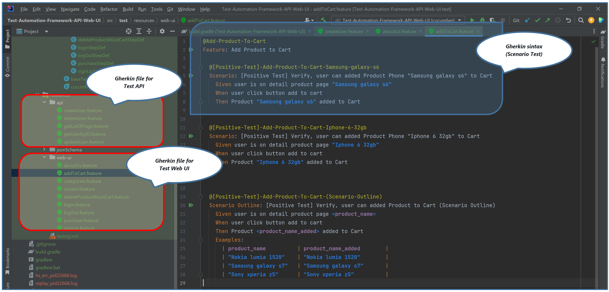
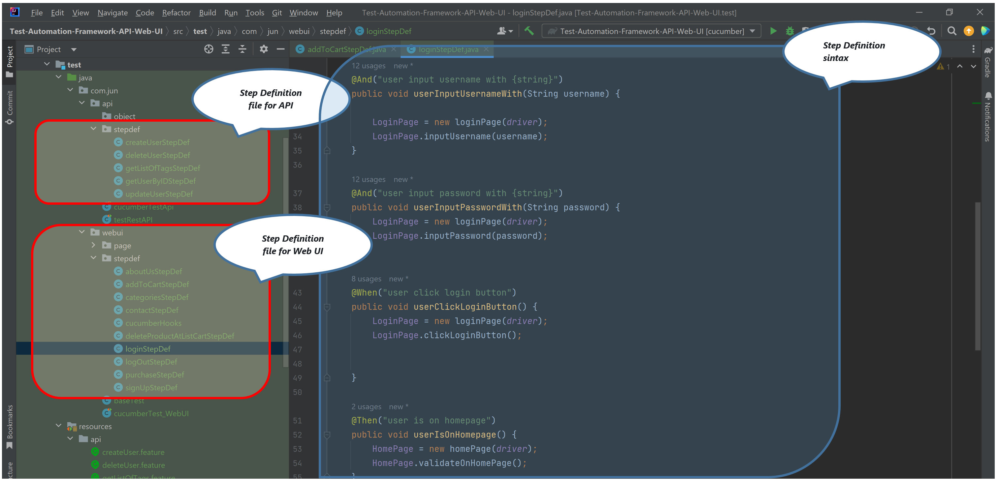
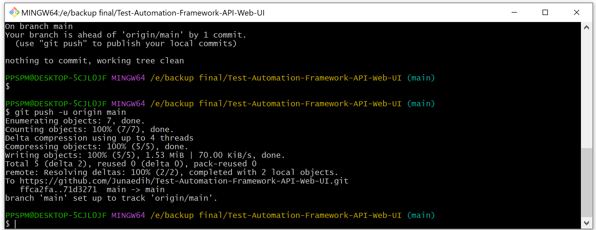
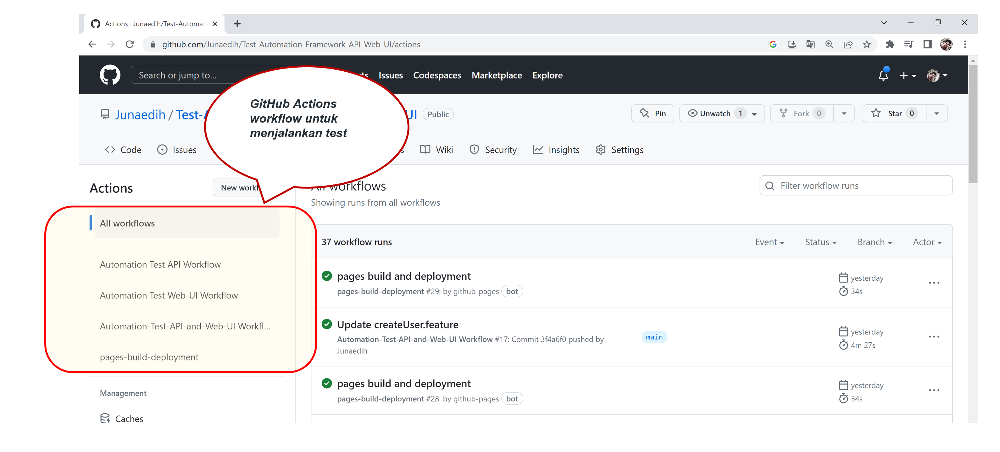
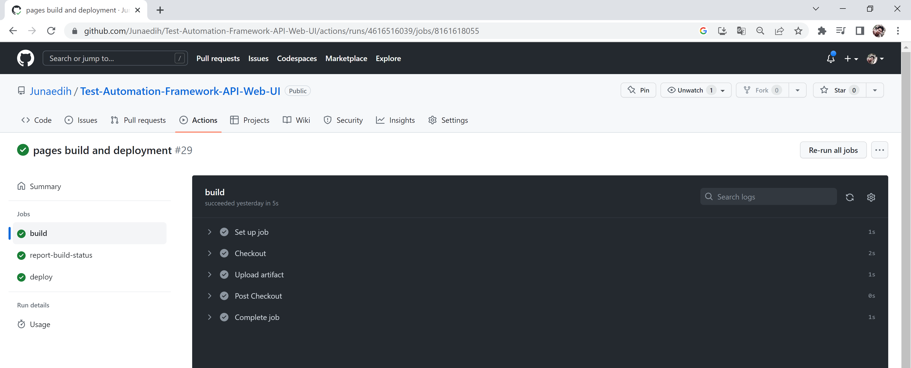
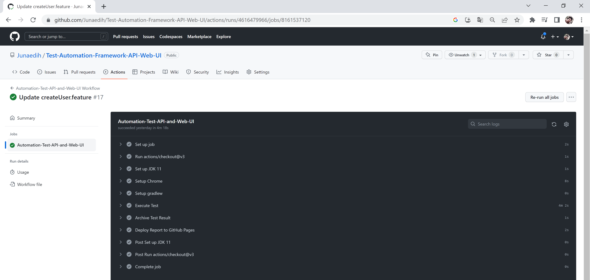
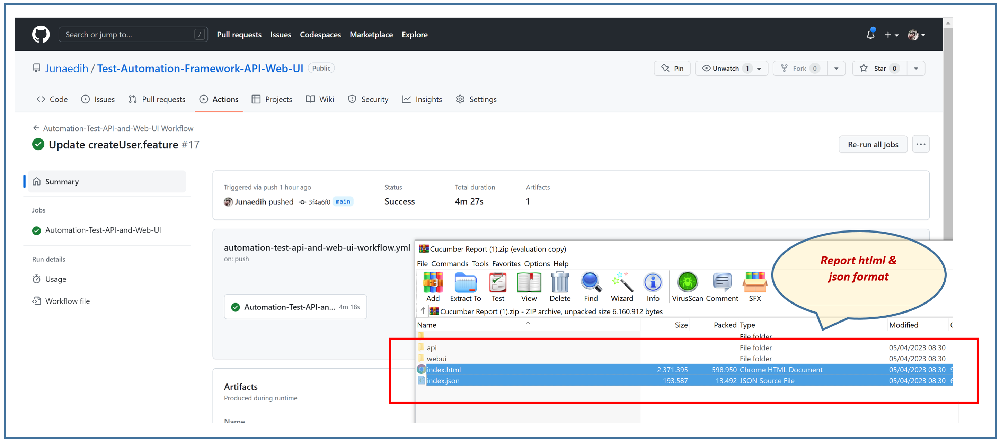
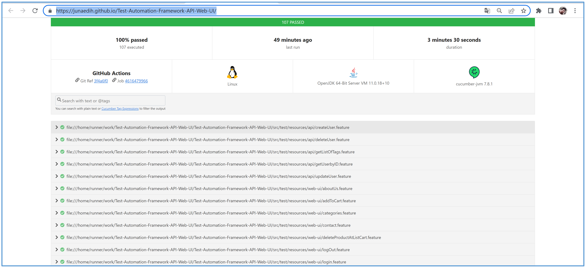

# Automation Test Framework API & Web UI
Test for API and Web UI in one repository, test case uses the Gherkin format, and Cucumber as a library for its implementation. Separate folder or package in Java Code, Step Definitions and Features for each type of test (Web and API). Report use Cucumber for HTML and JSON format, GitHub Actions workflow to run tests that have been made by way of (event) manual triggers and every time there is a Pull Request.
#
#### API target: https://dummyapi.io/docs/user
**The points in the test (API) :**
*	Get User by ID
*	Create User
*	Update User
*	Delete User
*	Get List Tags

#
#### Web UI (website) target: https://www.demoblaze.com/
**The points in the test (Web UI) :**
-	About Us
-	Home
-	Add Product to Cart
-	Display list product By Category
-	Contact
-	Delete Product at List Cart
-	Login
-	Logout
-	Purchase
-	SignUp

#
>All software needs to be tested before it is released to users. Software testing is a crucial part of the development cycle as it ensures good quality deliverables to the users. Every company focuses on testing, and most of them are tending towards automation testing over manual testing.

> #### What is the Automation Framework?

> Automation Framework is not a single tool or process, but it is a collection of tools and processes working together to support automated testing of any application. It integrates various functions like libraries, test data, and various reusable modules.

> #### Importance of Automation Framework in Software Testing

> The automation framework not only offers the benefit of reusing the code in various scenarios, but it also helps the team to write down the test script in a standard format. Hence, the test automation framework handles all the issues. Besides, there are many other benefits of using automation framework testing as listed below:

> * Maintain a well-defined strategy across the test suites
> * Enhanced speed at which testing progresses
> * Maintaining the test code will be easy
> * The URL or Application can be tested accurately
> * Continuous testing of coding and delivery will be achieved

> Test automation framework is helpful when you need to execute the same test scripts multiple times with different builds to examine the application and validate output. It is better to avoid automated testing for functionality, which you used only once since building automation script itself is time-consuming.
> [source][https://www.clariontech.com/blog/what-are-test-automation-frameworks-and-types]

#
### This project using :

* Git and GitHub
* Java
* Gradle
* Rest Assured
* Selenium Web Driver
* Cucumber
* GitHub Actions Workflow
* InteliJ IDEA
* Scenario Gherkin format
* Object Oriented Concept (Feature, Step Definition, Logic Code)
* Github Page

#
### ItelliJ IDEA Community Edition 2022.3.2

#
### Git version 2.39.1.windows.1

#
### GitHub Actions workflow to running test 

* Automation Test API Workflow
* Automation Test Web-UI Workflow
* Automation Test API and Web-UI Workflow

#
### Report menggunakan Cucumber untuk format HTML dan JSON

