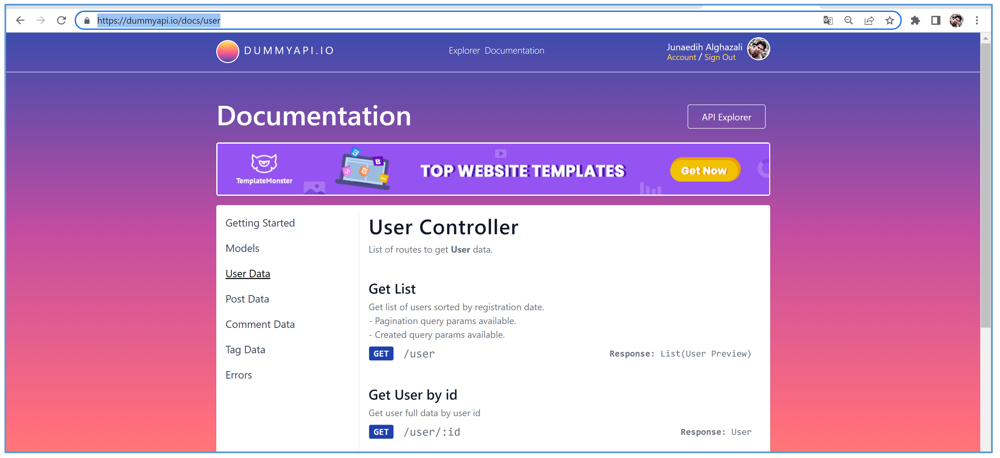
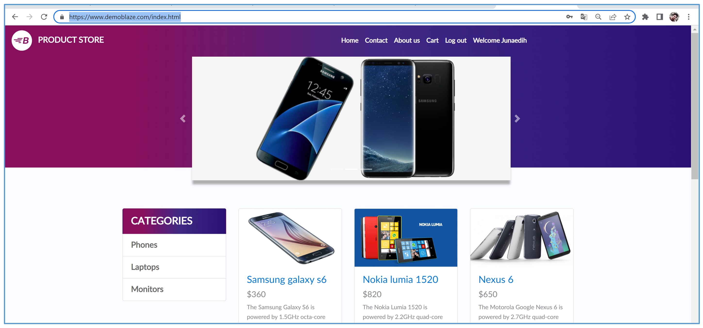

# Automation Test Framework API & Web UI
Test for API and Web UI in one repository, test case uses the Gherkin format, and Cucumber as a library for its implementation. Separate folder or package in Java Code, Step Definitions and Features for each type of test (Web and API). Report use Cucumber for HTML and JSON format, GitHub Actions workflow to run tests that have been made by way of (event) manual triggers and every time there is a Pull Request.
#
#### API target: https://dummyapi.io/docs/user
**The points in the test (API) :**
*	**Get User by ID**
*	**Create User**
*	**Update User**
*	**Delete User**
*	**Get List Tags**

#
#### Web UI (website) target: https://www.demoblaze.com/
**The points in the test (Web UI) :**
-	About Us
-	Home
-	Add Product to Cart
-	Display list product By Category
-	Contact
-	Delete Product at List Cart
-	Login
-	Logout
-	Purchase
-	SignUp

#
### This project using :

* Git and GitHub
* Java
* Gradle
* Rest Assured
* Selenium Web Driver
* Cucumber
* GitHub Actions Workflow
* InteliJ IDEA
* Scenario Gherkin format
* Object Oriented Concept (Feature, Step Definition, Logic Code)
* Github Page

